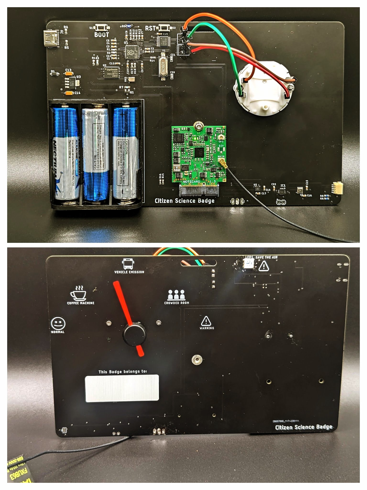

# Citizen Science Badge

This repository contains all the hardware files, firmware for the Citizen Science Badge. A detailed write-up of this badge is available from [here](https://www.hackster.io/yamanoorsai/citizen-science-badge-c66165).

The badge consists of the following components:

* Raspberry Pi RP2040 microcontroller with 64MB flash.
* Invensense ICS-41350 MEMS Microphone. The audio captured from the microphone is used to detect sound using Edge Impulse
* Blues Wireless cellular module is used to upload data points to the cloud as well as receive "Save The Air" alerts from the cloud.
* Automotive Gauge Stepper Motor (x27.168) - Used to indicate measured air quality index.
* Bosch BMI270 IMU to detect motion
* DA7280 for haptic feedback
* BME688 air quality sensor to calculate air quality index as well as detect odors
* JST/ Qwiic sensor port for connecting external sensors.
* 3 x AA battery pack
* USB C port for programming.

##Firmware##

Currently, the proof of concept has been implemented using Arduino. I plan to implement the code using the RP2040's C SDK. 

I have identified the following items as technical debt for this project.

* Implementing LED behavior for "Spare the Air" alerts
* The PCB design needs to be revised for low power operation
* The code needs to be re-written using the Pico C SDK
